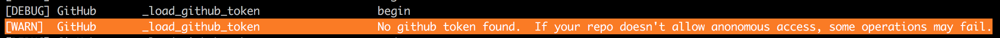
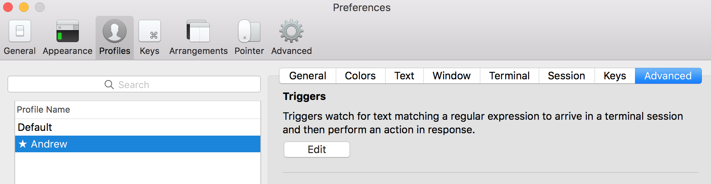
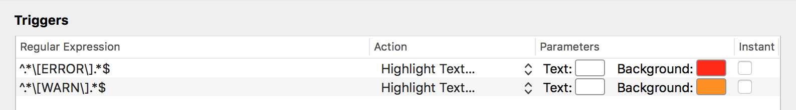

# Contributing

## Things to know before contributing code

* Fork the repository and make changes
* After your changes are complete, submit a pull request to the develop branch.
* Pull requests with excessive numbers of commits will typically be squashed if there are an excess number of commit messages.
* Include the story number in at least one of your commit messages like so `git commit -m "blah [#123456]"`
* **After** your changes have been propagated to develop and you have tested, you are ready to promote to master.  This is done via another pull request by you.
* Many changes will require unit tests.  If you submit significant changes with unit tests you may be asked to add them before the changes are accepted. This is a perfect opportunity to practice [TDD](https://en.wikipedia.org/wiki/Test-driven_development) if you are not already!

## Adding New Modules
### Reusable Modules
Most modules should be written in a manner that allows for reuse by the general public and other organizations.  These modules should be added to the flow folder.
### Proprietary Modules
At times, teams may wish to add functionality to Flow that includes proprietary logic and not meant for use outside of their company.  This can easily be achieved by following the Flow plugin architecture.  These changes should *not* be contributed back to this project.

First, ensure that your modules are created under the "plugins" directory.  An example, [foo](flow/plugins/foo/foo.py) is included in the project.

Second, when you create your module, ensure that you have also created a \__init__.py file. This file should implement:
* `parser` variable defining the parser name you plan to use when your module is called via flow 
*  method `register_parser` is required.  This is where you add the arguments for your parser.
*  method `run_action` is required.  Define the code that should be run when your parser option is activated.

```
from plugins.foo.foo import Foo

parser = 'foo'

def register_parser(new_parser):
    new_parser.add_argument('action', help='Action to take, possible values: bar, baz')
    new_parser.add_argument('-v', '--version', help='Version to use')

def run_action(args):
    foo = Foo()

    if args.action == 'fooa':
        foo.bar()
    elif args.action == 'foob':
        foo.baz()
```

#### Hooking into other module events
There may be times when you need to trigger code in your module based on other system events.  i.e. after deployment, attach the flow.log.txt to a change request

The preferred approach is to utilize [PyDispatch](http://pydispatcher.sourceforge.net) to emit events that require a dependency.


## Coding standards
The biggest rule is that you attempt to follow existing patterns and conventions in the code.  The authors of Flow attempted to follow [common patterns and best practices](https://www.python.org/dev/peps/pep-0008).  With that said, there are a few opinions that had to be decided on in order to be consistent.

#### Single vs Double Quote
In general, single quotes are used throughout this code unless the string is used for interpolation.  This is an opinion that we recommend following to maintain consistency.

#### Abstract Base Classes
[Abstract Base Classes](https://docs.python.org/2/library/abc.html) are used to define contracts and maintain standards across like classes - similar to interfaces in many OOP languages.  They provide Flow users the ability to add components to fit their needs.  For instance, swapping out artifact storage library Artifactory for Nexus.  

#### String Concatenation
Our preferred method for string concatenation is to use the format method of the [string](https://docs.python.org/2/library/string.html) class.

```
"Failed publishing with error: {error}".format(error = str(ex))
```

#### Logging
A common logging method has been established and should utilized in new code.  This logs code in a standard fashion:
&nbsp;&nbsp;&nbsp;&nbsp;&nbsp;&nbsp;&nbsp;&nbsp;`[ERROR] BuildConfig  checkFileExists  Cannot find buildConfig.json`

The equivalent code to log the message above would be:
```
commons.print_msg(BuildConfig.clazz, method, 'Cannot find buildConfig.json', 'ERROR')
```

Logging should done when there is information of significance that could help in troubleshooting.  Use your best judgement. The following will log a debug statement:
```
commons.print_msg(BuildConfig.clazz, method, 'Cannot find buildConfig.json') # DEBUG is default

commons.print_msg(BuildConfig.clazz, method, 'Cannot find buildConfig.json', 'DEBUG') # or you can explicitly define DEBUG
```

Warnings should be used when there is a likelihood that something seems abnormal but you do not want to fail.
```
commons.print_msg(BuildConfig.clazz, method, 'No token was defined.  Attempting to use anonymous authentication.', 'WARN')
```

#### Exiting on Error
If an error occurs that should halt flow CLI from continuing, in addition to logging an ERROR you will need to `Exit(1)`.  

#### Coupling
Please ensure that we don't tightly couple our classes together.  Flow is meant to be modular, allowing teams to pick/choose/create modules that work together.


## Environment Setup for Mac (Tested with 10.11.6)
* Using homebrew install python 3.
  * `/usr/bin/ruby -e "$(curl -fsSL https://raw.githubusercontent.com/Homebrew/install/master/install)"`
  * `brew install python3`

* Install PIP 3
  * `curl -Lk https://bootstrap.pypa.io/get-pip.py -o get-pip.py`
  * `python3 get-pip.py`

* Install Virtual Environment Wrapper
  * `sudo -H pip install virtualenvwrapper --ignore-installed six `
  * `source /usr/local/bin/virtualenvwrapper.sh`
    * If you want this to run automatically on future terminals then put the above command at end of `~/.bash_profile`
  * `mkvirtualenv -p $(which python3) flow`
  * `workon flow`

* Clone the flow repo and cd into that directory.

* Build flow from local code:
  `pip install -e ./`

## Environment Setup for Mac (10.11.6, imaged with pivotal/workstation-setup)
* Install Homebrew:
  * `/usr/bin/ruby -e "$(curl -fsSL https://raw.githubusercontent.com/Homebrew/install/master/install)"`

* Install Python/Python3:
  * `brew install python python3`

* Install virtualenv and virtualenvwrapper in Python3:
  * `pip3 install virtualenv virtualenvwrapper`

* Edit `~/.bash_profile` and add the following to interact with the virtual environment:

    ```
    VIRTUALENVWRAPPER_PYTHON=/usr/local/bin/python3
    WORKON_HOME=~/.virtualenvs
    source /usr/local/bin/virtualenvwrapper.sh
    ```

* Source the newly updated bash_profile:
  * `source ~/.bash_profile`

* Create the flow virtual environment:
  * `mkvirtualenv -p $(which python3) flow`

* Tell your system to use the flow virtual environment:
  * `workon flow`

* Clone the `ci-cd/flow` repo and cd into that directory:
  * `git clone ...`

* Build flow from local code:
  `pip install -e ./`

## Running Unit Tests on a Mac/Linux

* In an effort to make things simple, take a look at the `./unittest.sh` script.  You should just be able to run this and it will setup everything.  This can only be run after all of the Environment Setup is complete.

## Continuous Unit Testing on a Mac/Linux

* Run the `./unittest_continous.sh` script which just runs the `./unittest.sh` in a while loop for ever.  ctrl-c to quit.
* To continuously run tests while making code changes use the `pytest-watch` or if you don't feel like typing all of that then `ptw` will suffice


## Testing Flow Changes Locally
* Clone flow code
```
cd ~/Documents/workspace/
git clone ...
cd flow
```
* Make your enhancement or bug fixes to flow locally
* Build flow from local code:
  `pip install -e ./`
* Clone a project that you want to test with your flow changes
```
cd ~/Documents/workspace/
git clone ...
cd ...
```
* Run a flow command, testing against the test project cloned above.
```
#change to work on your local python virtualenv
workon flow
```
```
#these tokens may be required for your github task to run.  Set the environment variable, similar to concourse parameters/secrets.
export GITHUB_TOKEN= <<token>>
export SLACK_WEBHOOK_URL= <<url>>
export TRACKER_TOKEN= <<token>>
```
```
#run the flow task, pointing to the version of flow locally with the task of choice.  Below runs the github version task but this could be any flow task
flow github version -v v0.1.0 development
```

## Configuring iTerm on Mac to Color Code Warnings & Errors

In iTerm, go to `profiles` => `Open Profiles`.  
Select the profile to modify and click `Edit Profiles...`
Choose the `Advanced` tab and then under `Triggers` click on `Edit`

Add the following reg exs with colors of your choice:
```
^.*\[ERROR\].*$
^.*\[WARN\].*$
```
